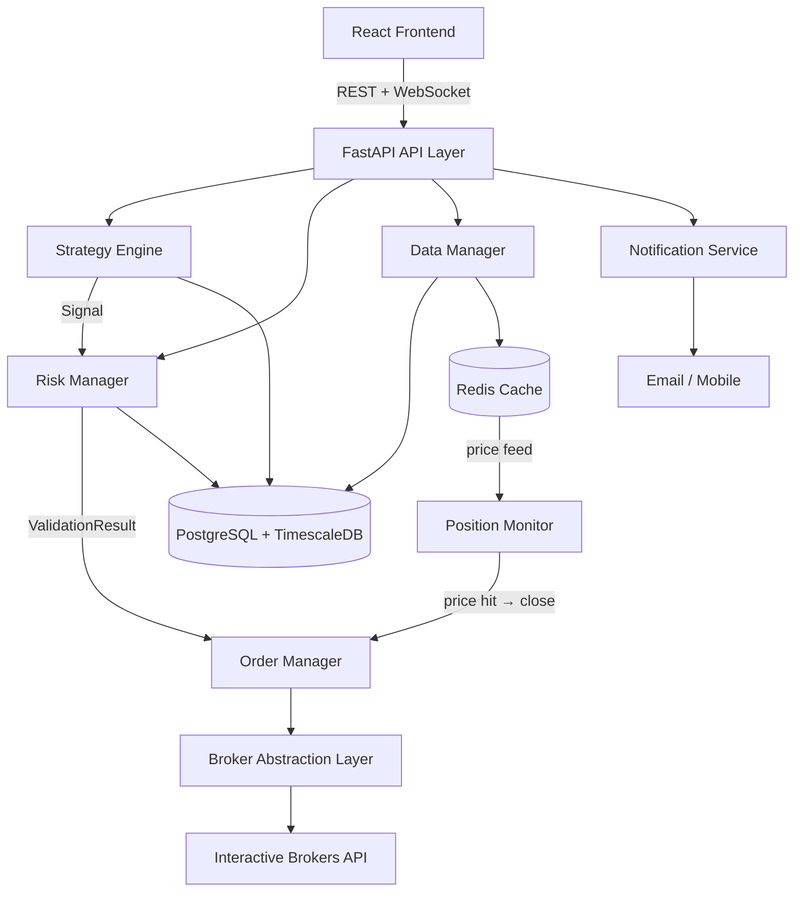

# design.md — System Architecture & Technical Design

> See `tech.md` for approved stack. See `structure.md` for file placement.

---

## System Architecture Overview

The system is composed of five primary layers communicating through well-defined interfaces. The backend is async-first (FastAPI + SQLAlchemy async), with Redis handling real-time pub/sub for live dashboard updates.



---

## Component Breakdown

### 1. API Layer (`backend/app/api/`)
- Thin FastAPI route handlers — no business logic
- Versioned under `/api/v1/`
- WebSocket endpoint at `/ws/dashboard` for real-time push
- Handles auth, request validation (Pydantic), and response formatting

### 2. Strategy Engine (`backend/app/core/strategy_engine/`)
- Executes registered strategies on a schedule or event trigger
- All strategies implement `BaseStrategy` abstract class
- Strategy registry allows runtime enable/disable without restart
- Supports strategy chaining: output signal of Strategy A can gate Strategy B

**Signal flow:**
```
Market Data → Strategy.generate_signal() → Signal
             (optional: stop suggestion, take-profit suggestion, submit_stop_to_broker flag)
                          ↓
             Signal + Portfolio State → RiskManager.validate()
             ├── Check 1: stop-loss present / valid
             ├── Check 2: position size within 1% rule
             ├── Check 3: R:R ratio ≥ minimum (calculate take-profit if not suggested)
             ├── Check 4: aggregate portfolio exposure ≤ max
             └── REJECT → log to risk.log → End
                 APPROVE → ValidationResult (stop, take_profit, quantity, risk_amount)
                          ↓
             OrderManager.submit_order() → Broker (entry order only)
                          ↓
             PositionMonitor watches price:{ticker} in Redis
             ├── price ≤ stop_loss_price  → OrderManager.close_position()
             └── price ≥ take_profit_price → OrderManager.close_position()
```

### 3. Risk Management (`backend/app/core/risk/`)

The risk engine is the sole authority on whether a trade may be entered and on what terms. Strategies feed signals in; the risk engine determines stop-loss, take-profit, position size, and portfolio-level fit.

**Per-trade rules (hard gates — not configurable):**
- Maximum loss per trade = 1% of current account balance
- Loss is defined as: `quantity × (entry_price − stop_loss_price)`
- A stop-loss price is **required** — orders without one are rejected outright
- Multiple trades can be open simultaneously; each independently capped at 1%

**Stop-loss ownership:**
- The risk engine owns stop-loss determination — it validates a strategy-suggested value or falls back to a calculated default
- Strategies may include a `stop_loss_price` suggestion in their signal; the risk engine accepts it only if valid (i.e. below entry, produces a sensible risk distance)

**Reward-to-risk ratio (configurable, default 2:1):**
- Every trade must achieve a minimum R:R ratio before entry is permitted
- `required_take_profit = entry_price + (stop_distance × min_rr_ratio)`
- Strategy may suggest a `take_profit_price`; accepted if ≥ `required_take_profit`, rejected otherwise
- If no suggestion is provided, the risk engine calculates `take_profit_price` mechanically
- Trades that cannot achieve the minimum R:R (e.g. mechanically calculated target is unrealistic given market conditions) are rejected — strategies are expected to skip such setups

**Portfolio-level constraint (configurable):**
- Maximum aggregate open exposure: default 5%, hard ceiling 10% (never configurable beyond 10%)
- `RiskManager.validate()` checks `current_aggregate_risk + new_risk_amount ≤ max_portfolio_risk` before approving
- New trades are rejected if they would push total exposure over the active limit

**Internal position monitoring (`PositionMonitor`):**
- Stop-loss and take-profit levels are stored in the `trades` table and monitored internally
- `PositionMonitor` subscribes to the Redis `price:{ticker}` feed and triggers `OrderManager.close_position()` when either level is hit
- Neither stop-loss nor take-profit needs to be sent to the broker — execution is managed by the system
- **Optional broker stop-loss**: a strategy may set `submit_stop_to_broker: true` on its signal to send the stop as a native broker stop order (provides protection if the system goes offline); take-profit is always managed internally

**Components:**
- `RiskCalculator`: derives max position size and validates/calculates stop & target prices
- `RiskManager`: orchestrates all gates — calls calculator, checks R:R, checks portfolio limit; returns `ValidationResult` with approved stop, take-profit, and position size
- `RiskMonitor`: polls open trades, computes aggregate exposure, emits WARNING (≥75% of max) and CRITICAL (≥90% of max) log alerts; wired to Redis pub/sub in Layer 14
- All trade executions must pass `RiskManager.validate()` before order submission

### 4. Broker Abstraction Layer (`backend/app/brokers/`)
- Abstract `BaseBroker` interface; all strategy and execution code depends on this, never on IBKR directly
- `IBKRClient` wraps `ib_async` (the actively maintained successor to `ib_insync` — see `tasks.md § Library Change`)
- `MockBroker` decouples all development and testing from any live broker dependency — the default for `ENVIRONMENT=development`

**How IBKR connectivity works at runtime:**

`IBKRClient` does not connect directly to IBKR's servers. It connects via TCP socket to a locally running **IB Gateway** process, which holds the authenticated IBKR session. The application never handles IBKR credentials.

```
IBKRClient (ib_async)
    │ TCP socket localhost:4001
    ▼
IB Gateway process (running locally or in Docker)
    │ authenticated session
    ▼
IBKR servers
```

IB Gateway must be running and authenticated before `IBKRClient.connect()` is called. Gateway authentication requires manual login (username + password + IBKR Mobile 2FA) once per session. See `ibkr-gateway.md` for setup and daily startup procedure.

### 5. Data Management (`backend/app/data/`)
- `MarketDataFeed`: subscribes to live price data from broker
- `HistoricalDataFetcher`: pulls OHLCV data for backtesting (1-year lookback)
- Market data is **temporary** — stored with overwrite policy, not archived
- `RedisCache`: wraps all Redis operations; used for real-time metrics and pub/sub

### 6. Monitoring (`backend/app/monitoring/`)
- Structured JSON logging via Python `logging` module
- Four log streams: trading, risk, system, error (see `structure.md`)
- `MetricsCollector`: aggregates KPIs into TimescaleDB for historical analysis
- `AlertEngine`: evaluates alert rules and dispatches to `NotificationDispatcher`

### 7. Frontend Dashboard (`frontend/src/`)
- Real-time panels via WebSocket subscription to `/ws/dashboard`
- TradingView charts for price/indicator visualization
- React Query for REST polling (slower-changing data)
- Primary view: risk exposure gauge relative to 1% threshold

**Symbol & strategy management is entirely frontend-driven:**
- Users add/remove watchlist symbols via the UI → persisted to DB via REST
- Users assign strategies to symbols via the Strategy Config UI → stored in strategy JSONB `config.symbols`
- The backend has no hardcoded symbol list; it operates only on what the watchlist contains

**Key frontend pages and panels:**

| Page / Panel | Purpose |
|---|---|
| Dashboard | Risk gauge, active trades, watchlist panel, system status |
| Watchlist Panel | Live price, day change, strategy assignment, position status per symbol |
| Strategies Page | Enable/disable, parameter config, symbol assignment per strategy |
| Portfolio Page | Positions, P&L, trade history |
| Symbol Detail | Price chart, strategy signals, trade history for one symbol |
| Backtesting Page | Run backtests, view results |
| System Health | Metrics, logs viewer |

---

## Data Flow Diagrams

### Trade Execution Flow
```
[Scheduler / Signal Trigger]
        │
        ▼
[Strategy Engine: generate_signal()]
        │ Signal (BUY/SELL/HOLD)
        │ optional: stop_loss_price, take_profit_price, submit_stop_to_broker
        ▼
[Risk Manager: validate()]
    ├── Gate 1: stop-loss present and valid
    ├── Gate 2: position size within 1% rule
    ├── Gate 3: R:R ≥ minimum (calculate take-profit if not provided)
    ├── Gate 4: aggregate exposure ≤ portfolio max
    ├── REJECT → Log to risk.log → End
    └── APPROVE → ValidationResult
            │  (stop_loss_price, take_profit_price, quantity, risk_amount)
            ▼
    [Order Manager: submit_order()]
            │ status → PENDING; trade row created; pre-submission audit written
            ▼
    [Broker Layer: place_order()]
            │ status → SUBMITTED
            ▼
    [IBKR API]
            │ Execution confirmation
            ├── REJECTED / ERROR → status → CANCELLED; logged
            └── FILLED / PARTIAL → status → OPEN
                    │ persists stop_loss_price, take_profit_price, reward_to_risk_ratio
                    ▼
            [Trade Repo: update_trade()]
                    │
                    ▼
            [Redis Pub/Sub: broadcast to dashboard]
                    │
                    ▼
            [Position Monitor: watches price:{ticker}]
            ├── price ≤ stop_loss_price  → close_position(reason=STOP_LOSS)
            │                               status → CLOSING
            └── price ≥ take_profit_price → close_position(reason=TAKE_PROFIT)
                                             status → CLOSING
                    │
                    ▼
            [Broker Layer: place_order() — close]
                    │ confirmation
                    ▼
            status → CLOSED; exit_price, exit_reason, pnl written
```

### Dashboard Real-time Update Flow
```
[Risk Monitor / Trade Handler]
        │ publishes event
        ▼
    [Redis Pub/Sub Channel: dashboard_updates]
        │
        ▼
    [FastAPI WebSocket Handler]
        │ pushes JSON message
        ▼
    [React Frontend WebSocket client]
        │
        ▼
    [React Query cache invalidation → UI re-render]
```

### Watchlist Price Feed Flow
```
[IBKR Real-time Price Feed]
        │ tick data per watched symbol
        ▼
[MarketDataFeed: on_price_update()]
        │ update Redis key: price:{ticker}
        ▼
    [Redis Pub/Sub: publish to watchlist_prices channel]
        │
        ▼
    [FastAPI WebSocket Handler]
        │ push { event: "price_update", ticker, price, day_change }
        ▼
    [WatchlistPanel React component re-renders row]
```

### Symbol–Strategy Resolution Flow (at signal generation)
```
[Strategy Scheduler: run cycle]
        │
        ▼
[StrategyRegistry: get enabled strategies]
        │ for each strategy
        ▼
[Read config.symbols from JSONB]
        │ for each assigned symbol
        ▼
[Fetch price data from Redis / TimescaleDB]
        │
        ▼
[Strategy.generate_signal(symbol, data)]
```

---

## Database Schema Design

### `watched_symbols`
| Column | Type | Notes |
|--------|------|-------|
| `id` | UUID PK | |
| `ticker` | VARCHAR(10) | Unique; e.g. `AAPL` |
| `display_name` | VARCHAR | e.g. `Apple Inc.` — populated on add |
| `is_active` | BOOLEAN | Soft disable without removing |
| `added_at` | TIMESTAMPTZ | |
| `updated_at` | TIMESTAMPTZ | |

### `trades`
| Column | Type | Notes |
|--------|------|-------|
| `id` | UUID PK | |
| `strategy_id` | UUID FK | → `trading_strategies` |
| `symbol` | VARCHAR(10) | Ticker symbol |
| `direction` | ENUM | `BUY`, `SELL` |
| `quantity` | DECIMAL | Sized to satisfy 1% rule |
| `entry_price` | DECIMAL | |
| `stop_loss_price` | DECIMAL | **Required** — set by risk engine (strategy suggestion validated or overridden) |
| `take_profit_price` | DECIMAL | **Required** — set by risk engine (strategy suggestion validated or calculated from R:R) |
| `reward_to_risk_ratio` | DECIMAL | Actual R:R of the trade at entry: `(take_profit − entry) / (entry − stop_loss)` |
| `exit_price` | DECIMAL | Nullable until closed |
| `exit_reason` | ENUM | Nullable until closed: `STOP_LOSS`, `TAKE_PROFIT`, `MANUAL` |
| `status` | ENUM | `PENDING` → `SUBMITTED` → `OPEN` → `CLOSING` → `CLOSED` (or `CANCELLED`) — see lifecycle below |
| `risk_amount` | DECIMAL | `quantity × (entry_price − stop_loss_price)` — must be ≤ 1% of account balance at entry |
| `account_balance_at_entry` | DECIMAL | Snapshot of balance used for 1% calculation |
| `pnl` | DECIMAL | Nullable until closed |
| `executed_at` | TIMESTAMPTZ | |
| `closed_at` | TIMESTAMPTZ | Nullable |
| `created_at` | TIMESTAMPTZ | |

**Trade status lifecycle:**
```
PENDING   — trade row created; risk validation passed; pre-submission audit written;
            order not yet sent to broker
    ↓
SUBMITTED — entry order sent to broker; awaiting fill confirmation
    ↓
OPEN      — broker confirmed fill (FILLED or PARTIAL); PositionMonitor now active for this trade
    ↓
CLOSING   — stop or target hit; close order submitted to broker; awaiting confirmation
    ↓
CLOSED    — close order confirmed by broker; exit_price, exit_reason, pnl written

CANCELLED — order was rejected or cancelled before reaching OPEN
            (broker REJECTED response, or manual cancel while PENDING/SUBMITTED)
```

Transitions are only ever forward. No state may go backward. `CANCELLED` is only reachable from `PENDING` or `SUBMITTED`. Any unexpected transition is logged as an error.

### `trading_strategies`
| Column | Type | Notes |
|--------|------|-------|
| `id` | UUID PK | |
| `name` | VARCHAR | |
| `type` | VARCHAR | e.g. `moving_average`, `mean_reversion` |
| `is_enabled` | BOOLEAN | |
| `config` | JSONB | Strategy parameters including `symbols` array — e.g. `{ "fast_period": 50, "slow_period": 200, "symbols": ["AAPL", "MSFT"] }` |
| `created_at` | TIMESTAMPTZ | |
| `updated_at` | TIMESTAMPTZ | |

### `portfolio_snapshots` (TimescaleDB hypertable)
| Column | Type | Notes |
|--------|------|-------|
| `time` | TIMESTAMPTZ | Partition key |
| `total_equity` | DECIMAL | |
| `cash_balance` | DECIMAL | |
| `open_position_value` | DECIMAL | |
| `open_trade_count` | INTEGER | Number of active trades |
| `aggregate_risk_amount` | DECIMAL | Sum of `risk_amount` across all open trades |
| `aggregate_risk_pct` | DECIMAL | `aggregate_risk_amount / account_balance` — e.g. 5 trades = ~5% |
| `max_per_trade_risk_pct` | DECIMAL | Should always be ≤ 1%; flags breaches if > 1% |

### `system_logs`
| Column | Type | Notes |
|--------|------|-------|
| `id` | BIGSERIAL PK | |
| `level` | VARCHAR | `INFO`, `WARNING`, `ERROR`, `CRITICAL` |
| `category` | ENUM | `TRADING`, `RISK`, `SYSTEM`, `ERROR` |
| `message` | TEXT | |
| `context` | JSONB | Structured contextual data |
| `created_at` | TIMESTAMPTZ | |

---

## API Design Patterns

- All endpoints return consistent envelope:
```json
{
  "data": { ... },
  "meta": { "timestamp": "...", "request_id": "..." },
  "error": null
}
```
- Errors return `4xx/5xx` with:
```json
{
  "data": null,
  "error": { "code": "RISK_LIMIT_EXCEEDED", "message": "..." }
}
```
- WebSocket messages follow:
```json
{
  "event": "trade_executed | risk_alert | position_update",
  "payload": { ... },
  "timestamp": "..."
}
```

---

## Performance Considerations

- **Async everywhere**: All I/O (DB, broker, Redis) uses async drivers (`asyncpg`, `redis.asyncio`)
- **Redis caching**: Current risk metrics and active positions cached; invalidated on state change
- **Batched metric writes**: Performance metrics buffered and written in batches to TimescaleDB
- **TimescaleDB compression**: Enable chunk compression on `portfolio_snapshots` after 7 days
- **Connection pooling**: SQLAlchemy async pool sized to expected concurrency (start: min 5, max 20)

---

## Audit Trail (Non-Negotiable Requirement)

Every trade execution must produce two mandatory log entries in `trading.log` — one before broker submission and one after confirmation (or failure). This is not optional and cannot be bypassed by any code path.

### Pre-Submission Entry (before order reaches broker)
Must include:
- Timestamp, trade ID, symbol, direction, quantity
- Entry price, stop-loss price, calculated risk amount
- Account balance at time of validation
- Strategy ID and signal that triggered the trade
- Risk validation result (always APPROVED at this stage — rejections never reach this step)

### Post-Confirmation Entry (after broker responds)
Must include:
- Timestamp, trade ID, broker order ID
- Execution status: `FILLED`, `PARTIAL`, `REJECTED`, `ERROR`
- Actual filled price and quantity (may differ from requested)
- Any broker error codes or messages
- Final recorded risk amount based on actual fill price

### Implementation Rules
- Both entries are written within the `OrderManager.submit_order()` execution path
- If the post-confirmation write fails, the error is escalated to `error.log` and a system alert is triggered — a missing post-confirmation entry is treated as a system fault
- Log entries are append-only and must never be modified after writing
- Audit logs are retained separately from rotating application logs (no overwrite policy)

---

## Security Considerations

- All broker API credentials stored in environment variables only — never in DB or source
- Sensitive fields (account numbers, API keys) masked in all log output
- No user authentication required (personal-use system), but API should bind to localhost or VPN only in production
- HTTPS enforced for any external notification webhook delivery
- **Live trading guard**: `IBKRClient.connect()` must raise an error if `ENVIRONMENT=development` and `IBKR_TRADING_MODE=live` are set simultaneously — prevents accidental live order submission during development. This is enforced in code, not just convention.
- **Trading mode**: `IBKR_TRADING_MODE` env var controls paper vs live at the Gateway login level; the application code is identical in both modes. Default must be `paper`. See `ibkr-gateway.md § Paper vs Live Mode`.

---

> See `requirements.md` for feature user stories.
> See `tasks.md` for implementation task breakdown.
> See `ibkr-gateway.md` for IB Gateway setup, authentication, and daily startup procedure.
